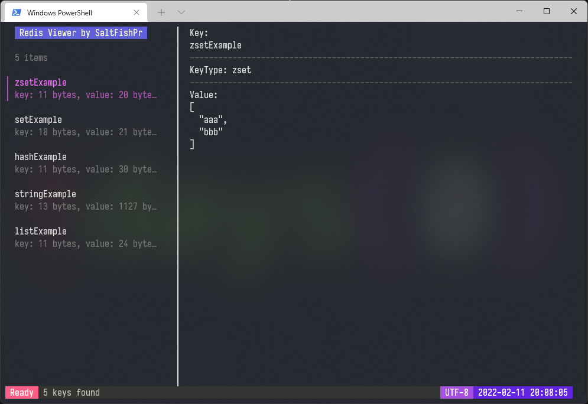

# Redis Viewer

A tool to view Redis data in terminal, fork from [saltfishpr/redis-viewer](https://github.com/saltfishpr/redis-viewer).



## Install

    go install github.com/bingoohuang/redis-viewer/....@latest

## Usage:

See help: `redis-viewer --help`


| KeyBoard | Description            |
|:--------:|:-----------------------|
|  ctrl+c  | exit redis viewer      |
|    ↑     | previous key           |
|    ↓     | next key               |
|    ←     | previous page          |
|    →     | next page              |
|    r     | reload data from redis |
|    s     | enter search keywords  |
|    e     | export values to JSON  |
|  enter   | apply scan with text   |

|    Mouse    | Description        |
|:-----------:|:-------------------|
|  scroll up  | detail scroll up   |
| scroll down | detail scroll down |


- default config file path is `$HOME/.redis-viewer.yaml` 
- or environment REDIS like `export REDIS='addr=192.168.0.1:6379&db=0&pwd=abc'` 

example config file:

```yaml
addrs:
    - 127.0.0.1:6379

db:
username:
password:

master_name:
```

## Support:

- client, sentinel and cluster mode.
- `string, hash, list, set, zset` key types.

## Note:

In Windows, you should change system encoding to `UTF-8` before run this program.

## TODOs:

-   [x] Add load animation.
-   [x] Friendly value detail.
-   [ ] Add log view.

Build with [bubbletea](https://github.com/charmbracelet/bubbletea).
